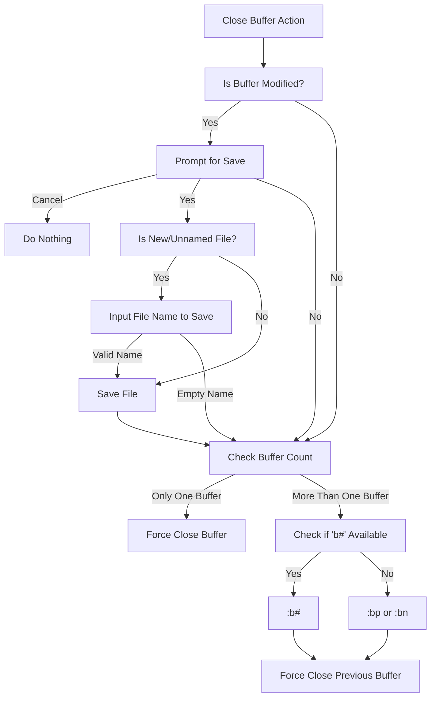

Here is roughly how this plugin works

```mermaid

   graph TD;
    CloseBuffer["Close Buffer Action"] --> isBufferModified["Is Buffer Modified?"];
    
    isBufferModified -- "Yes" --> Prompt["Prompt for Save"];
    isBufferModified -- "No" --> checkBufferCount;
    
    Prompt -- "Cancel" --> DoesNothing["Do Nothing"];
    Prompt -- "Yes" --> isNewUnnamedFile["Is New/Unnamed File?"];
    Prompt -- "No" --> checkBufferCount;
    
    isNewUnnamedFile -- "Yes" --> InputFileNameToSave["Input File Name to Save"];
    isNewUnnamedFile -- "No" --> Save["Save File"];
    
    InputFileNameToSave -- "Valid Name" --> Save;
    InputFileNameToSave -- "Empty Name" --> checkBufferCount;
    
    Save --> checkBufferCount;
    
    checkBufferCount["Check Buffer Count"] -- "Only One Buffer" --> forceCloseBuffer["Force Close Buffer"];
    checkBufferCount -- "More Than One Buffer" --> checkAlternateBuffer["Check if 'b#' Available"];
    
    checkAlternateBuffer -- "Yes" --> switchToPreviousBuffer[":b#"];
    checkAlternateBuffer -- "No" --> switchFallback[":bp or :bn"];
    
    switchToPreviousBuffer --> forceClosePreviousBuffer["Force Close Previous Buffer"];
    switchFallback --> forceClosePreviousBuffer;

```
